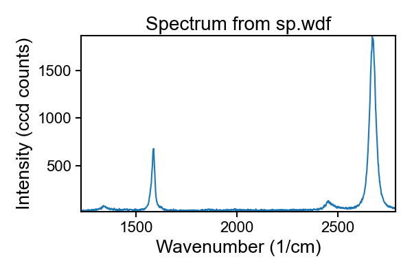
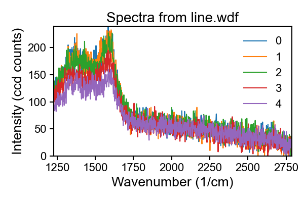
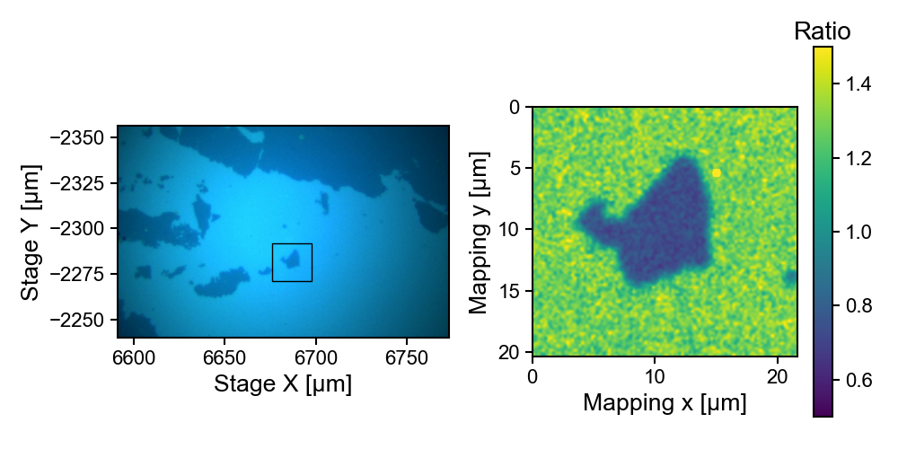
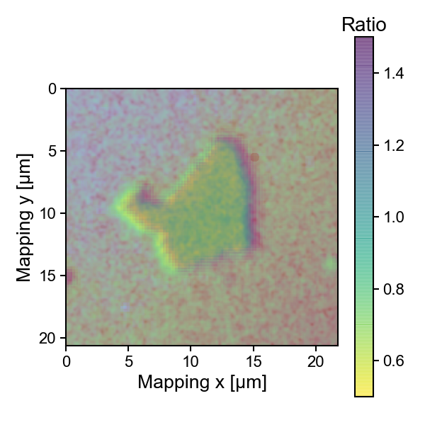

# `renishawWiRE` Renishaw Raman spectroscopy parser in python

[](https://badge.fury.io/py/renishawWiRE)
[](https://conda.anaconda.org/alchem0x2a)
[](https://conda.anaconda.org/alchem0x2a)


A python wrapper for read-only accessing the wdf Raman spectroscopy file format created
by the WiRE software of Ranishaw Inc.  Renishaw Inc owns copyright of
the wdf file format.

Ideas for reverse-engineering the WDF format is inspired by:

- [Renishaw File Reader](https://zenodo.org/record/495477#.XsZs3y17FBw) by Alex Henderson (DOI:10.5281/zenodo.495477))
- Renishaw IO module in [`Gwyddion`](http://gwyddion.net/module-list-nocss.en.php)

# Installation

Requirements:

- `python>=3.6`
- `Numpy>=1.12.0`
- `Matplotlib>=2.1.0` (optional, if you want to plot the spectra in the examples)
- `Pillow>=3.4.0` (optional, if you want to extract the white light
   image) 
   
   **Warning** there are some API changes to `Pillow` after
   version 7.2.0 (thanks @markotoplak). Please update `renishawWiRE`
   to version >= 0.1.8 if you are experiencing problems with Tiff image
   extraction.
   
You can choose any of the following installation methods:

### 1. Versions hosted on PyPI: via `pip`

```bash
# Optionally on a virtualenv
# Add --user if you don't want to install as sys admin
pip install --upgrade renishawWiRE
```

If you need full plotting / image extraction support, consider
specifying the extras to `pip`.
```bash
# Optionally on a virtualenv
pip install --upgrade "renishawWiRE[plot]"
```

### 2. `HEAD` version: via `git` + `pip`

To install the package without examples, run the following commands
(installing extra `matplotlib` and `Pillow` if not present):

```bash
git clone https://github.com/alchem0x2A/py-wdf-reader.git
cd py-wdf-reader
pip install -e ".[plot]"
```

### 3. Via `anaconda`
The version hosted by `anaconda` will install all dependent packages including `numpy` `matplotlib` and `Pillow`

```bash
conda install -c alchem0x2a renishaw_wire
```

## Test installation

Simply try if importing works:
```bash
python -c "import renishawWiRE"
```
and test the executable binary:
```bash
wdf-export -h
```

Additionally, if you want to test the examples, download them from the
[binary
release](https://github.com/alchem0x2A/py-wdf-reader/releases/download/binary/spectra_files.zip)
and overwrite the dummy files within `examples/spectra_files/`:
```bash
wget https://github.com/alchem0x2A/py-wdf-reader/releases/download/binary/spectra_files.zip 
unzip -o spectra_files.zip -d examples/ 
rm spectra_files.zip
# To avoid unexpected pushing to repo due to large file size
git update-index --skip-worktree examples/spectra_files.wdf
```

# Basic Usage

Check the sample codes in `examples/` folder for more details about
what the package can do.

## 1. Simple script for exporting wdf spectra (version > 0.1.11)

The package also installs a simple wrapper script `wdf-export` for
exporting spectra in the wdf file to plain-text formats. If the
measurement contains mapping information, the optical image is also
exported (as `.svg` file)

### Usage
Simply use the base name of input file for the exported text file:
```bash
wdf-export path/to/wdf_file
```
or specifying the input and output files
```bash
wdf-export path/to/wdf_file -o path/to/output.csv
```


## 2. Python API
### Get file information

`renishawWiRE.WDFReader` is the main entry point to get information of a WDF file.

```python
# The following example shows how to get the info from a WDF file
# Check `examples/ex1_getinfo.py`
from renishawWiRE import WDFReader

#`filename` can be string, file obj or `pathlib.Path`
filename = "path/to/your/file.wdf"
reader = WDFReader(filename)
reader.print_info()
```

### Get single point spectrum / spectra

When the spectrum is single-point (`WDFReader.measurement_type == 1`),
`WDFReader.xdata` is the spectral points, and `WDFReader.spectra` is
the accumulated spectrum.

```python
# Example to read and plot single point spectrum
# Assume same file as in previous section
# Check `examples/ex2_sp_spectra.py`
import matplotlib.pyplot as plt
wavenumber = reader.xdata
spectra = reader.spectra
plt.plot(wavenumber, spectra)
```

An [example](examples/ex2_sp_spectra.py) is shown below:



### Get depth series spectra

A depth series measures contains single point spectra with varied
Z-depth. For this type `WDFReader.measurement_type == 2`. The code to
get the spectra are the same as the one in the single point spectra
measurement, instead that the `WDFReade.spectra` becomes a matrix with
size of `(count, point_per_spectrum)`. The `WDFReader.zpos` returns
the values of z-scan points.

For details of Z-depth data processing, check this
[example](examples/ex8_depth.py)


### Get line scan from StreamLine™ / StreamHR Line™ measurements

For mapped measurements (line or grid scan),
`WDFReader.measurement_type == 3`.  The code to get the spectra are
the same as the one in the single point spectra measurement, instead
that the `WDFReade.spectra` becomes a matrix with size of `(count, point_per_spectrum)`:

```python
# Example to read line scane spectrum
# Check `examples/ex3_linscan.py`
filename = "path/to/line-scan.wdf"
reader = WDFReader(filename)
wn = reader.xdata
spectra = reader.spectra
print(wn.shape, spectra.shape)
```

An [example](examples/ex3_linscan.py) of the line scane is shown below:



It is also possible to correlate the xy-coordinates with the
spectra. For a mapping measurement, `WDFReader.xpos` and
`WDFReader.ypos` will contain the point-wise x and y coordinates.

```python
# Check examples/ex4_linxy.py for details
x = reader.xpos
y = reader.ypos
# Cartesian distance
d = (x ** 2 + y ** 2) ** (1 / 2)
```


### Get grid mapping from StreamLine™ / StreamHR Line™ measurements

Finally let's extract the grid-spaced Raman data. For mapping data
with `spectra_w` pixels in the x-direction and `spectra_h` in the
y-direction, the matrix of spectra is shaped into `(spectra_h,
spectra_w, points_per_spectrum)`.

Make sure your xy-coordinates starts from the top left corner.

```python
# For gridded data, x and y are on rectangle grids
# check examples/ex5_mapping.py for details
x = reader.xpos
y = reader.ypos
spectra = reader.spectra
# Use other packages to handle spectra
# write yourself the function or use a 3rd-party libray
mapped_data = some_treating_function(spectra, **params)
# plot mapped data using plt.imshow
plt.pcolor(mapped_data, extends=[0, x.max() - x.min(),
                                 y.max() - y.min(), 0])
```
An [example](examples/ex5_mapping.py) of mapping data is shown below:


You can also work on the white-light image which automatically saved
during a mapped scan. The jpeg-form image can be obtained by
`WDFReader.img` as an io object, and some further informations about
the dimensions etc. For this to work you need `Pillow` installed as third-party
library:

- Get coordinates of white-light image

```python
# There are two-sets of coordinates.
# `xpos` and `ypos` are the Stage XY-coordinate of the mapped area
# while `img_origins` and `img_dimensions` are size (μm) of white-light image
# See examples/ex6_mapping_img.py for details
import matplotlib.image as mpimg
img_x0, img_y0 = reader.img_origins
img_w, img_h = reader.img_dimensions
plt.imshow(reader.img, 
           extent=(img_x0, img_x0 + img_w,
                   img_y0 + img_h, img_y0))
```
An [example](examples/ex6_mapping_img.py) of mapped area on white light image is shown below:



- Overlaying white-light image with mapped spectra

```python
# `img_cropbox` is the pixel positions for cropping
# Requires PIL to operate
# See examples/ex7_overlay_mapping.py for details
img = PIL.Image.open(reader.img)
img1 = img.crop(box=reader.img_cropbox)
extent = ... # Same extent for both images
plt.imshow(img1, alpha=0.5, extent=extent) # White light image 
plt.imshow(spectra, alpha=0.5, extent=extent) # Mapped spectra
```

The following [example](examples/ex7_overlay_mapping.py) shows the
overlayed image of both fields. Some degree of misalignment can be
observed.




# TODOs

There are still several functionalities not implemented:

- [x] Extract image info
- [x] Verify image coordinate superposition
- [x] Improve series measurement retrieval
- [ ] Testing on various version of Renishaw instruments
- [x] Binary utilities

# Bug reports

The codes are only tested on the Raman spectra files that generated
from my personal measurements. If you encounter any peculiar behavior
of the package please kindly open an issue with your report /
suggestions. Thx!

